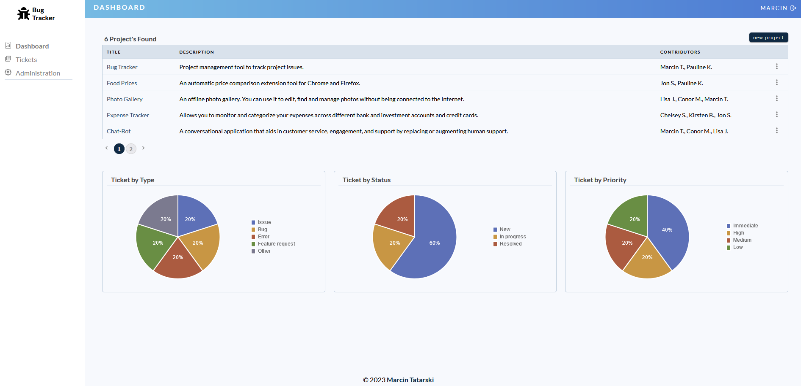

# Bug Tracker App

    

Welcome to my Bug Tracker app! This app is designed to help you manage and track software bugs. It was developed as a way to showcase my development skills and demonstrate my ability to solve complex problems.

## Features
The Bug Tracker app includes the following features:
- Easy-to-use bug reporting interface
- Customizable bug tracking status options
- Detailed bug information, including status, priority, and notes
- Dashboard for tracking bug progress and status
- Search functionality: Easily find tickets by searching through keywords or phrases.
- Filter tickets by status, priority, or type: Quickly sort through tickets to find the ones that require your attention.
- Filter tickets in ascending or descending order: Prioritize your workload by viewing tickets in the order that is most important to you.

To see the app in action, please visit [my YouTube](https://youtu.be/f5QCdUTQo28) channel where you can watch Bug Tracker demo.

To learn more about the app and its features, please visit my website at https://marcin-tatarski.com/projects.html

## Contact Me
If you're interested in learning more about the app or seeing the code, please feel free to contact me directly. I'm always looking for new opportunities to grow and develop my skills as a developer, and I believe this app is a testament to my passion and dedication.

Thank you for taking the time to check out my work. If you have any questions or feedback, please don't hesitate to get in touch.

## Important Note
Please note that this README is intended to be made public, while the repository itself remains private.
